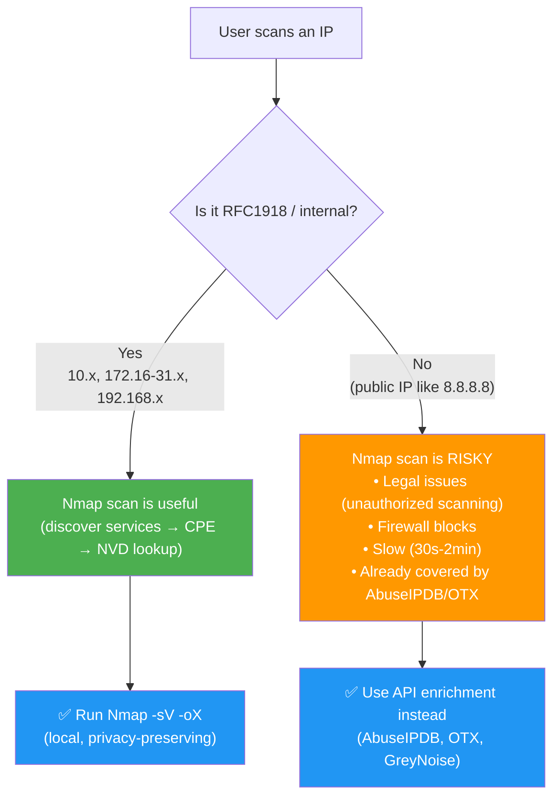
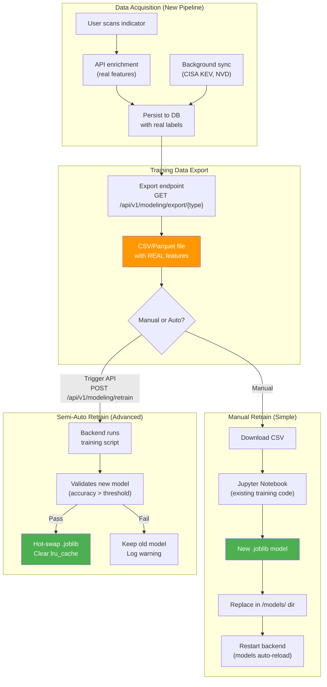
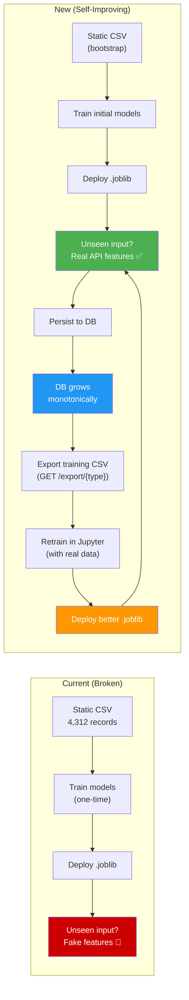

# ThreatLensAI: Real-Time Data Pipeline — Implementation Plan

## 1. Assessment of Refined Architecture

### ✅ What's Strong

| Addition | Verdict | Why |
|----------|---------|-----|
| **Parallel async enrichment** (Step 2) | ✅ **Essential** | This is the core fix. Replaces fabricated hash features with real API data. Directly solves the generalization failure. |
| **Persist all telemetry to DB** (Step 4) | ✅ **Essential** | Monotonic growth guarantee. Every scan enriches the database. |
| **Score using REAL features** (Step 5) | ✅ **Essential** | ML models finally receive the feature distribution they were trained on. |
| **TTL-based cache invalidation** | ✅ **Essential** | Keeps data fresh without redundant API calls. |
| **Provenance tagging** (Step 7) | ✅ **Excellent** | Users need to know whether data came from DB cache, live API, or LLM analysis. Transparency builds trust. |

### ⚠️ What Needs Careful Scoping

#### Nmap Integration (Step 3)

The paper uses Nmap for **internal network vulnerability assessment** in small organizations. In ThreatLensAI's context, this adds value but introduces significant complexity:



> [!WARNING]
> **Recommendations for Nmap:**
> - Gate behind `ENABLE_NMAP_SCAN=false` config flag (disabled by default)
> - **Only allow** RFC1918 / private IP ranges — never scan external IPs from the app
> - Run in a sandboxed subprocess with timeout (max 60s)
> - Requires `nmap` to be installed on the host system
> - **Phase this in later** (Phase 3-4) — it's not needed to solve the core generalization problem

**Suggested scope**: Make Nmap a Phase 3+ feature. The priority is fixing the unseen-sample problem with API enrichment, which works for **all** indicator types.

#### Local LLM / Ollama Fallback (Step 6)

This is a creative idea but needs guardrails:

| Concern | Mitigation |
|---------|-----------|
| **Hallucination risk** — LLM may invent threat details for an unknown indicator | Never let LLM output influence the numeric threat score. Use it only for natural-language summary/recommendation. |
| **Availability** — Ollama may not be installed | Gate behind `ENABLE_LLM_FALLBACK=false`. Graceful degradation to "No data available" if missing. |
| **Latency** — Local inference can be slow on CPU | Set timeout (10s). Use small models (e.g., `mistral:7b` or `phi3:mini`). |
| **Scope** — What exactly does the LLM analyze? | It should summarize what's known, not assess what's unknown. Feed it the actual API results or lack thereof. |

> [!TIP]
> **Recommended LLM role**: The LLM should be a **summarizer/advisor**, not a **scorer**. It generates human-readable analysis text for the UI's "AI Analysis" section — but the actual threat score and verdict come from the ML models + real features.

```
╔══════════════════════════════════════════╗
║  Threat Score: 7.8/10 ← ML model only   ║
║  Verdict: MALICIOUS   ← ML model only   ║
║                                          ║
║  🤖 AI Analysis (Ollama):               ║
║  "This IP (45.33.32.156) is associated   ║
║  with Shodan scanning infrastructure.    ║
║  AbuseIPDB reports 89% confidence with   ║
║  342 reports. Recommend blocking at       ║
║  perimeter firewall."                    ║
║                                          ║
║  📊 Data Sources: AbuseIPDB, OTX        ║
╚══════════════════════════════════════════╝
```

---

## 2. Addressing the ML Retraining Question

> "Is there another way to let me train the models on newest datasets from this architecture?"

**Yes — and this is one of the strongest benefits of this architecture.** The real-time pipeline naturally creates a self-improving ML lifecycle:



### Recommended Approach: **Export Endpoint + Manual Retrain** (Low Complexity)

This gives you full control without adding complexity to the backend:

#### How It Works

1. **Database accumulates real data** — every scan enriches the DB with real API features
2. **Export endpoint** generates fresh CSV/Parquet from the DB (matching your original training format)
3. **You retrain in Jupyter** using your existing notebook workflow
4. **Drop new `.joblib` files** into `/models/` and restart

#### Implementation Details

```python
# New router: backend/app/routers/modeling.py (add export endpoints)

@router.get("/export/{indicator_type}")
def export_training_data(indicator_type: str, format: str = "csv"):
    """
    Export enriched data from DB in training-ready format.
    
    indicator_type: "ip", "domain", "cve", "otx"
    format: "csv" or "parquet"
    
    Returns the same column schema as the original training CSVs,
    but now populated with REAL API-enriched data.
    """
```

#### Why This Beats Automated Retraining (For Now)

| Approach | Complexity | Risk | Control |
|----------|-----------|------|---------|
| **Export + Manual retrain** | ✅ Low | ✅ Low (you validate) | ✅ Full |
| Semi-auto (API trigger) | ⚠️ Medium | ⚠️ Medium (needs validation) | ⚠️ Partial |
| Fully automated | ❌ High | ❌ High (silent degradation) | ❌ Low |

> [!IMPORTANT]
> **Start with Export + Manual.** You can always add automation later. The critical thing is that the database now contains **real features** that match your training distribution — the export is just `SELECT * FROM malicious_ips WHERE data_source != 'csv_import'`.

### Training Data Growth Tracking

Add a simple table to track dataset growth:

```sql
CREATE TABLE IF NOT EXISTS training_metadata (
    id INTEGER PRIMARY KEY AUTOINCREMENT,
    indicator_type TEXT NOT NULL,           -- "ip", "domain", "cve", "otx"
    total_records INTEGER NOT NULL,
    api_enriched_records INTEGER NOT NULL,  -- records with real API data
    exported_at TIMESTAMP,
    model_version TEXT,                     -- e.g., "ip_xgb_v2_20260521"
    notes TEXT
);
```

This lets you answer: "How many real-data records do I have? Is it enough to retrain?"

---

## 3. Phased Implementation Plan

### Phase 1: API Client Layer + Real-Time Enrichment (Core Fix)
**Goal**: Replace fabricated features with real API data. This alone solves 90% of the problem.

**New files to create:**

| File | Purpose |
|------|---------|
| `backend/app/services/api_clients/__init__.py` | Package init |
| `backend/app/services/api_clients/base_client.py` | Shared async HTTP client with retry, rate limiting, timeout |
| `backend/app/services/api_clients/nvd_client.py` | NVD API 2.0 — query CVE by ID, get CVSS/CWE/references |
| `backend/app/services/api_clients/otx_client.py` | AlienVault OTX — query pulses, IPs, domains |
| `backend/app/services/api_clients/abuseipdb_client.py` | AbuseIPDB — query IP reputation |
| `backend/app/services/enrichment_pipeline.py` | Orchestrator: determines indicator type → calls correct APIs → persists → returns features |
| `backend/app/models/api_cache.py` | SQLAlchemy model for api_cache table |
| `backend/app/models/enrichment_log.py` | SQLAlchemy model for enrichment audit log |

**Files to modify:**

| File | Changes |
|------|---------|
| `backend/app/config.py` | Add API key env vars, TTL settings, feature flags |
| `backend/app/services/scan_service.py` | Replace `_heuristically_analyze_unseen_*()` with `enrichment_pipeline.enrich()` |
| `backend/sql/schema.sql` | Add new tables + columns |
| `backend/requirements.txt` | Add `httpx` (async HTTP) |

**Schema changes:**

```sql
-- Extend existing tables
ALTER TABLE malicious_ips ADD COLUMN data_source TEXT DEFAULT 'csv_import';
ALTER TABLE malicious_ips ADD COLUMN enriched_at TIMESTAMP;

ALTER TABLE malicious_domains ADD COLUMN enriched_at TIMESTAMP;

ALTER TABLE cve_vulnerabilities ADD COLUMN cvss_v3_score REAL;
ALTER TABLE cve_vulnerabilities ADD COLUMN cvss_v3_vector TEXT;
ALTER TABLE cve_vulnerabilities ADD COLUMN enriched_at TIMESTAMP;

-- API response cache
CREATE TABLE IF NOT EXISTS api_cache (
    cache_key TEXT PRIMARY KEY,
    source TEXT NOT NULL,
    response_json TEXT NOT NULL,
    queried_at TIMESTAMP NOT NULL,
    expires_at TIMESTAMP NOT NULL
);

-- Enrichment audit log
CREATE TABLE IF NOT EXISTS enrichment_log (
    id INTEGER PRIMARY KEY AUTOINCREMENT,
    indicator_type TEXT NOT NULL,
    indicator_value TEXT NOT NULL,
    api_source TEXT NOT NULL,
    success BOOLEAN DEFAULT TRUE,
    error_message TEXT,
    enriched_at TIMESTAMP DEFAULT CURRENT_TIMESTAMP,
    latency_ms INTEGER
);
```

**Refactored scan flow (pseudocode):**

```python
# scan_service.py — refactored unseen-indicator branch

if top_result is None:  # Not in DB
    # Step 1: Try real-time API enrichment
    enrichment = await enrichment_pipeline.enrich(query, input_type)
    
    if enrichment.success:
        # Step 2: Persist real features to DB (monotonic growth)
        db_row = persist_enrichment(db, enrichment)
        
        # Step 3: ML prediction on REAL features
        ml_prediction = predict_with_real_features(db_row, input_type)
        
        # Step 4: Score using real data
        score, severity, tags, summary = score_from_enrichment(enrichment)
        
    else:
        # Fallback: API failed/unavailable
        # Option A: Return UNKNOWN with explanation
        # Option B: If LLM enabled, get AI summary (no score influence)
        pass
```

### Phase 2: Training Data Export + Background Sync

**New files:**

| File | Purpose |
|------|---------|
| `backend/app/services/background_sync.py` | Scheduled CISA KEV + NVD recent CVE sync |
| `backend/app/routers/modeling.py` | Add `/export/{type}` endpoint for training data |

**Background sync jobs:**
- Daily: Fetch CISA KEV catalog JSON → upsert `cve_vulnerabilities`
- Daily: Fetch NVD modified CVEs (last 24h) → upsert `cve_vulnerabilities`
- Weekly: Refresh OTX subscribed pulses → upsert `otx_pulses`

### Phase 3: Nmap Integration (Optional, Paper-Aligned)

**New files:**

| File | Purpose |
|------|---------|
| `backend/app/services/nmap_service.py` | Execute Nmap, parse XML, extract CPE |
| `backend/app/models/nmap_results.py` | SQLAlchemy model for scan results |

**Gated behind**: `ENABLE_NMAP_SCAN=false` (disabled by default)
**Scope**: RFC1918 IPs only

### Phase 4: Local LLM Fallback (Optional)

**New files:**

| File | Purpose |
|------|---------|
| `backend/app/services/llm_service.py` | Ollama HTTP client with security-focused prompts |

**Gated behind**: `ENABLE_LLM_FALLBACK=false` (disabled by default)
**Role**: Summarizer/advisor only — never influences threat score

---

## 4. Configuration Design

```python
# config.py additions

# API Keys
nvd_api_key: str = os.getenv("NVD_API_KEY", "")
otx_api_key: str = os.getenv("OTX_API_KEY", "")
abuseipdb_api_key: str = os.getenv("ABUSEIPDB_API_KEY", "")

# Cache TTLs (seconds)
cache_ttl_ip: int = int(os.getenv("CACHE_TTL_IP", "86400"))       # 24 hours
cache_ttl_domain: int = int(os.getenv("CACHE_TTL_DOMAIN", "259200"))  # 3 days
cache_ttl_cve: int = int(os.getenv("CACHE_TTL_CVE", "604800"))    # 7 days
cache_ttl_otx: int = int(os.getenv("CACHE_TTL_OTX", "604800"))    # 7 days

# Feature flags
enable_nmap_scan: bool = os.getenv("ENABLE_NMAP_SCAN", "false").lower() == "true"
enable_llm_fallback: bool = os.getenv("ENABLE_LLM_FALLBACK", "false").lower() == "true"
ollama_base_url: str = os.getenv("OLLAMA_BASE_URL", "http://localhost:11434")
ollama_model: str = os.getenv("OLLAMA_MODEL", "mistral:7b")

# Rate limiting
nvd_requests_per_30s: int = int(os.getenv("NVD_RATE_LIMIT", "5"))  # 50 with API key
abuseipdb_daily_limit: int = int(os.getenv("ABUSEIPDB_DAILY_LIMIT", "1000"))
```

---

## 5. What Gets Removed

The following **fabricated-feature code** will be replaced:

| Code | Lines | Replacement |
|------|-------|-------------|
| `_heuristically_analyze_unseen_ip()` | [scan_service.py L221-329](file:///c:/Users/Admin/Documents/GitHub/threat-lens-ai/backend/app/services/scan_service.py#L221-L329) | `enrichment_pipeline.enrich_ip()` → real AbuseIPDB/OTX data |
| `_heuristically_analyze_unseen_domain()` | [scan_service.py L332-395](file:///c:/Users/Admin/Documents/GitHub/threat-lens-ai/backend/app/services/scan_service.py#L332-L395) | `enrichment_pipeline.enrich_domain()` → real OTX/WHOIS data |
| Hash-based fake country/ASN/votes | Throughout unseen handlers | Real API-sourced features |

> [!NOTE]
> The heuristic functions won't be fully deleted — they'll be kept as a **degraded fallback** (clearly labeled `data_source: "heuristic_fallback"`) for when all APIs are unreachable. But they'll never be the primary path.

---

## 6. ML Lifecycle Summary



The key insight: **Every user scan makes the system smarter.** The database accumulates real-world labeled data that directly feeds back into model retraining. The original 4,312 CSV records become the bootstrap seed; the enriched API data becomes the growing training corpus.
